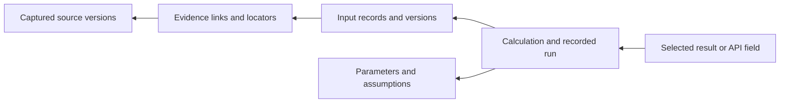

# Result explorer and reports

Status: planned. Delivery tasks are tracked in [ROADMAP.md](../ROADMAP.md).
This is a generic toolkit feature; example-specific analysis belongs to its
consuming repository.

## Reader experience

Start with a final result: a KPI, chart, table, report claim, or a field in a
recorded API response. Show its label, value, unit, scope, time period, and
provenance status. The reader should be able to answer:

1. What does this result mean, and which version am I looking at?
2. Which calculation produced it, with which inputs and parameters?
3. Where did each input come from, down to a record or source locator?
4. Which choices are assumptions, and what has been corrected or remains uncertain?
5. Was the result reported, executed, or successfully replayed?

An API URL alone does not identify immutable data. Inspection must resolve to a
recorded response/artifact, its version or content hash, and a field/record
selector. Mapping a live API field to that record belongs to the consuming
application. The explorer must not fetch authenticated APIs merely because a
reader opens a report.

## Interaction design

- A result overview gives readers meaningful entry points, including search.
- Selecting a result opens an expandable, connected dependency graph: result,
  calculation, input records, and source evidence. Group branches by purpose,
  collapse repeated dependencies, and expand detail on demand.
- Clicking a calculation opens a readable description or expression, the actual
  recorded code reference, parameters, input versions, output, and run status.
  A description must not stand in for missing executable code.
- Clicking an input opens its value, unit, record key, backing evidence, and
  assumption/correction status.
- Clicking evidence opens its source title, captured version/hash, retrieval
  details, exact locator, and a reviewed excerpt when available and permitted.
  Missing, restricted, binary, or unverifiable content is shown explicitly.
- Back navigation, breadcrumbs, stable version-aware links, keyboard operation,
  and an accessible linear/table view support the same inspection path.
- A downstream view shows affected outputs after a source or parameter changes.
  Historical results remain distinguishable from current results requiring review.

## Explanation contract

Use the existing twelve node types and eight MCP tools. An API response or
published result is represented with existing artifacts, datasets, indicators,
or claims and their metadata. Reuse the current explain/traversal, record backing,
content, assumption ledger, and replay-verification queries; extend an existing
query mode only when an explicit gap is demonstrated.

The selection identifies both the logical node and the inspected version or
run. For historical calculations, the retained execution bundle is authoritative;
current logical-node edges must not silently substitute newer inputs. Present
record-level backing and edge qualifiers, not just graph reachability. Missing
provenance, provisional links, and conflicting evidence must remain visible.

A reported run is never labeled verified/reproducible. A successful execution
is distinct from a successful verified replay. The UI must preserve those
existing semantics and show actionable gaps rather than fabricate a complete chain.

## Shareable report

A self-contained HTML report combines selected results, focused lineage views,
calculation details, reviewed evidence references, assumptions, and review status.
It opens without a server or network dependency. A result can be linked directly,
and print output includes the context needed to understand its sources and method.

Build on the existing safe HTML exporter: graph strings remain inert data,
external resources are not loaded automatically, and source bytes or credentials
are not embedded by default. The author selects and reviews the material to
include; there must be a preview of exactly what will be shared. Restricted
content is represented by an explicit omission, not a broken or misleading link.

## Current baseline and acceptance

The existing HTML export is a searchable node list with upstream/downstream
filters and a JSON inspector. It is useful for inspection but does not yet
provide the connected result-first graph, readable calculation panels, or
curated report described here. Raw metadata can remain an optional detail view.

Acceptance requires an end-to-end browser test that selects a result, follows
its calculation and record backing to an exact source version, inspects an
assumption, and shows the impact of a correction. Include missing evidence,
shared dependencies/cycles, historical versus current inputs, and reported
versus replayed runs. Test safe rendering, offline operation, deep links,
keyboard access, and readable behavior on a realistically sized fixture.
